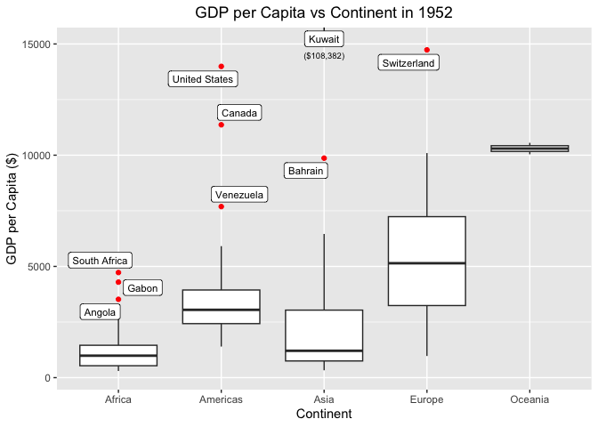
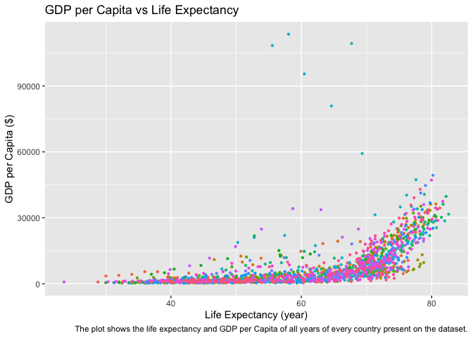

Gapminder
================
Daeyoung Kim
2023-02-26

- <a href="#grading-rubric" id="toc-grading-rubric">Grading Rubric</a>
  - <a href="#individual" id="toc-individual">Individual</a>
  - <a href="#due-date" id="toc-due-date">Due Date</a>
- <a href="#guided-eda" id="toc-guided-eda">Guided EDA</a>
  - <a
    href="#q0-perform-your-first-checks-on-the-dataset-what-variables-are-in-this"
    id="toc-q0-perform-your-first-checks-on-the-dataset-what-variables-are-in-this"><strong>q0</strong>
    Perform your “first checks” on the dataset. What variables are in
    this</a>
  - <a
    href="#q1-determine-the-most-and-least-recent-years-in-the-gapminder-dataset"
    id="toc-q1-determine-the-most-and-least-recent-years-in-the-gapminder-dataset"><strong>q1</strong>
    Determine the most and least recent years in the <code>gapminder</code>
    dataset.</a>
  - <a
    href="#q2-filter-on-years-matching-year_min-and-make-a-plot-of-the-gdp-per-capita-against-continent-choose-an-appropriate-geom_-to-visualize-the-data-what-observations-can-you-make"
    id="toc-q2-filter-on-years-matching-year_min-and-make-a-plot-of-the-gdp-per-capita-against-continent-choose-an-appropriate-geom_-to-visualize-the-data-what-observations-can-you-make"><strong>q2</strong>
    Filter on years matching <code>year_min</code>, and make a plot of the
    GDP per capita against continent. Choose an appropriate
    <code>geom_</code> to visualize the data. What observations can you
    make?</a>
  - <a
    href="#q3-you-should-have-found-at-least-three-outliers-in-q2-but-possibly-many-more-identify-those-outliers-figure-out-which-countries-they-are"
    id="toc-q3-you-should-have-found-at-least-three-outliers-in-q2-but-possibly-many-more-identify-those-outliers-figure-out-which-countries-they-are"><strong>q3</strong>
    You should have found <em>at least</em> three outliers in q2 (but
    possibly many more!). Identify those outliers (figure out which
    countries they are).</a>
  - <a
    href="#q4-create-a-plot-similar-to-yours-from-q2-studying-both-year_min-and-year_max-find-a-way-to-highlight-the-outliers-from-q3-on-your-plot-in-a-way-that-lets-you-identify-which-country-is-which-compare-the-patterns-between-year_min-and-year_max"
    id="toc-q4-create-a-plot-similar-to-yours-from-q2-studying-both-year_min-and-year_max-find-a-way-to-highlight-the-outliers-from-q3-on-your-plot-in-a-way-that-lets-you-identify-which-country-is-which-compare-the-patterns-between-year_min-and-year_max"><strong>q4</strong>
    Create a plot similar to yours from q2 studying both
    <code>year_min</code> and <code>year_max</code>. Find a way to highlight
    the outliers from q3 on your plot <em>in a way that lets you identify
    which country is which</em>. Compare the patterns between
    <code>year_min</code> and <code>year_max</code>.</a>
- <a href="#your-own-eda" id="toc-your-own-eda">Your Own EDA</a>
  - <a
    href="#q5-create-at-least-three-new-figures-below-with-each-figure-try-to-pose-new-questions-about-the-data"
    id="toc-q5-create-at-least-three-new-figures-below-with-each-figure-try-to-pose-new-questions-about-the-data"><strong>q5</strong>
    Create <em>at least</em> three new figures below. With each figure, try
    to pose new questions about the data.</a>

*Purpose*: Learning to do EDA well takes practice! In this challenge
you’ll further practice EDA by first completing a guided exploration,
then by conducting your own investigation. This challenge will also give
you a chance to use the wide variety of visual tools we’ve been
learning.

<!-- include-rubric -->

# Grading Rubric

<!-- -------------------------------------------------- -->

Unlike exercises, **challenges will be graded**. The following rubrics
define how you will be graded, both on an individual and team basis.

## Individual

<!-- ------------------------- -->

| Category    | Needs Improvement                                                                                                | Satisfactory                                                                                                               |
|-------------|------------------------------------------------------------------------------------------------------------------|----------------------------------------------------------------------------------------------------------------------------|
| Effort      | Some task **q**’s left unattempted                                                                               | All task **q**’s attempted                                                                                                 |
| Observed    | Did not document observations, or observations incorrect                                                         | Documented correct observations based on analysis                                                                          |
| Supported   | Some observations not clearly supported by analysis                                                              | All observations clearly supported by analysis (table, graph, etc.)                                                        |
| Assessed    | Observations include claims not supported by the data, or reflect a level of certainty not warranted by the data | Observations are appropriately qualified by the quality & relevance of the data and (in)conclusiveness of the support      |
| Specified   | Uses the phrase “more data are necessary” without clarification                                                  | Any statement that “more data are necessary” specifies which *specific* data are needed to answer what *specific* question |
| Code Styled | Violations of the [style guide](https://style.tidyverse.org/) hinder readability                                 | Code sufficiently close to the [style guide](https://style.tidyverse.org/)                                                 |

## Due Date

<!-- ------------------------- -->

All the deliverables stated in the rubrics above are due **at midnight**
before the day of the class discussion of the challenge. See the
[Syllabus](https://docs.google.com/document/d/1qeP6DUS8Djq_A0HMllMqsSqX3a9dbcx1/edit?usp=sharing&ouid=110386251748498665069&rtpof=true&sd=true)
for more information.

``` r
library(tidyverse)
```

    ## ── Attaching core tidyverse packages ──────────────────────── tidyverse 2.0.0 ──
    ## ✔ dplyr     1.1.0     ✔ readr     2.1.4
    ## ✔ forcats   1.0.0     ✔ stringr   1.5.0
    ## ✔ ggplot2   3.4.1     ✔ tibble    3.1.8
    ## ✔ lubridate 1.9.2     ✔ tidyr     1.3.0
    ## ✔ purrr     1.0.1     
    ## ── Conflicts ────────────────────────────────────────── tidyverse_conflicts() ──
    ## ✖ dplyr::filter() masks stats::filter()
    ## ✖ dplyr::lag()    masks stats::lag()
    ## ℹ Use the ]8;;http://conflicted.r-lib.org/conflicted package]8;; to force all conflicts to become errors

``` r
library(gapminder)
library(rstatix)
```

    ## 
    ## Attaching package: 'rstatix'
    ## 
    ## The following object is masked from 'package:stats':
    ## 
    ##     filter

``` r
library(ggrepel)
library(latex2exp)
```

*Background*: [Gapminder](https://www.gapminder.org/about-gapminder/) is
an independent organization that seeks to educate people about the state
of the world. They seek to counteract the worldview constructed by a
hype-driven media cycle, and promote a “fact-based worldview” by
focusing on data. The dataset we’ll study in this challenge is from
Gapminder.

# Guided EDA

<!-- -------------------------------------------------- -->

First, we’ll go through a round of *guided EDA*. Try to pay attention to
the high-level process we’re going through—after this guided round
you’ll be responsible for doing another cycle of EDA on your own!

### **q0** Perform your “first checks” on the dataset. What variables are in this

dataset?

``` r
gapminder %>% 
  head(5)
```

    ## # A tibble: 5 × 6
    ##   country     continent  year lifeExp      pop gdpPercap
    ##   <fct>       <fct>     <int>   <dbl>    <int>     <dbl>
    ## 1 Afghanistan Asia       1952    28.8  8425333      779.
    ## 2 Afghanistan Asia       1957    30.3  9240934      821.
    ## 3 Afghanistan Asia       1962    32.0 10267083      853.
    ## 4 Afghanistan Asia       1967    34.0 11537966      836.
    ## 5 Afghanistan Asia       1972    36.1 13079460      740.

**Observations**:

- Write all variable names here `country`, `continent`, `year`,
  `lifeExp`, `pop`, and `gdpPercap` are variable in the dataset.

### **q1** Determine the most and least recent years in the `gapminder` dataset.

*Hint*: Use the `pull()` function to get a vector out of a tibble.
(Rather than the `$` notation of base R.)

``` r
## TASK: Find the largest and smallest values of `year` in `gapminder`
year_max <- gapminder %>% summarize(max(year)) %>% pull() 
year_min <- gapminder %>% summarize(min(year)) %>% pull() 

gapminder %>% 
  filter(year == year_max) %>% 
  filter(continent == "Oceania")
```

    ## # A tibble: 2 × 6
    ##   country     continent  year lifeExp      pop gdpPercap
    ##   <fct>       <fct>     <int>   <dbl>    <int>     <dbl>
    ## 1 Australia   Oceania    2007    81.2 20434176    34435.
    ## 2 New Zealand Oceania    2007    80.2  4115771    25185.

Use the following test to check your work.

``` r
## NOTE: No need to change this
assertthat::assert_that(year_max %% 7 == 5)
```

    ## [1] TRUE

``` r
assertthat::assert_that(year_max %% 3 == 0)
```

    ## [1] TRUE

``` r
assertthat::assert_that(year_min %% 7 == 6)
```

    ## [1] TRUE

``` r
assertthat::assert_that(year_min %% 3 == 2)
```

    ## [1] TRUE

``` r
if (is_tibble(year_max)) {
  print("year_max is a tibble; try using `pull()` to get a vector")
  assertthat::assert_that(False)
}

print("Nice!")
```

    ## [1] "Nice!"

### **q2** Filter on years matching `year_min`, and make a plot of the GDP per capita against continent. Choose an appropriate `geom_` to visualize the data. What observations can you make?

You may encounter difficulties in visualizing these data; if so document
your challenges and attempt to produce the most informative visual you
can.

``` r
## TASK: Create a visual of gdpPercap vs continent
gapminder %>% 
  filter(year == year_min) %>% 
  group_by(continent) %>% 
  mutate(outlier = ifelse(is_outlier(gdpPercap, coef = 1.5), TRUE, FALSE)) %>% 
  ggplot(mapping = aes(continent, gdpPercap)) +
  geom_boxplot(outlier.color = 'red') + 
  scale_y_log10() +
  geom_label_repel(
    data = . %>% filter(outlier == TRUE),
    aes(label = country),
    box.padding = 0.2,
    na.rm = TRUE,
    size = 3
    ) +
  labs( 
    y = "GDP per Capita ($)",
    x = "Continent",
    title = "GDP per Capita vs Continent in 1952"
  ) +
  theme(
    plot.title = element_text(hjust = 0.5),
    plot.caption = element_text(hjust = 0.5)
  )
```

<!-- -->

``` r
gapminder %>% 
  filter(year == year_min) %>% 
  group_by(continent) %>% 
  mutate(outlier = ifelse(is_outlier(gdpPercap, coef = 1.5), TRUE, FALSE)) %>% 
  ggplot(mapping = aes(continent, gdpPercap)) +
  geom_boxplot(outlier.color = 'red') + 
  coord_cartesian(ylim = c(200, 15000)) +
  geom_label_repel(
    data = . %>% filter(outlier == TRUE),
    aes(label = country),
    box.padding = 0.2,
    na.rm = TRUE,
    size = 3
    ) +
  geom_text(x = 3, y = 14500, size = 2.5, aes(label = "($108,382)"), data = data.frame(year = 1952)) +
  labs( 
    y = "GDP per Capita ($)",
    x = "Continent",
    title = "GDP per Capita vs Continent in 1952"
  ) +
  theme(
    plot.title = element_text(hjust = 0.5),
    plot.caption = element_text(hjust = 0.5)
  )
```

<!-- -->
**Observations**:

- There are significant differences in the median `gdpPercap` with
  regards to `continent`.
- There are some countries that earn much more than other countries in
  the same `continent`.
- There are very few number of countries that belong to the continent of
  `Oceania`.
- There are outliers that are above the 75th quantile but not below the
  25th quantile.

**Difficulties & Approaches**:

- Because there is a huge outlier in the continent of Asia, it was
  extremely difficult to make out much meaningful observations.
  Therefore, a logarithmic scale was applied to the y-axis to better
  visualize the plot.
- To have a better understanding of the context of the outliers, I added
  names of the country as label to the outliers.
- However, due to the logarithmic scale, it was difficult to observe the
  relative differences between `continent` that had `gdpPercap` in a
  different location in the y-axis. Thus, I zoomed in to the plot
  excluding `Kuwait` with a linear y-axis scale.

### **q3** You should have found *at least* three outliers in q2 (but possibly many more!). Identify those outliers (figure out which countries they are).

``` r
## TASK: Identify the outliers from q2
gapminder %>% 
  filter(year == year_min) %>% 
  group_by(continent) %>% 
  mutate(outlier = ifelse(is_outlier(gdpPercap, coef = 1.5), TRUE, FALSE)) %>% 
  filter(outlier == TRUE)
```

    ## # A tibble: 9 × 7
    ## # Groups:   continent [4]
    ##   country       continent  year lifeExp       pop gdpPercap outlier
    ##   <fct>         <fct>     <int>   <dbl>     <int>     <dbl> <lgl>  
    ## 1 Angola        Africa     1952    30.0   4232095     3521. TRUE   
    ## 2 Bahrain       Asia       1952    50.9    120447     9867. TRUE   
    ## 3 Canada        Americas   1952    68.8  14785584    11367. TRUE   
    ## 4 Gabon         Africa     1952    37.0    420702     4293. TRUE   
    ## 5 Kuwait        Asia       1952    55.6    160000   108382. TRUE   
    ## 6 South Africa  Africa     1952    45.0  14264935     4725. TRUE   
    ## 7 Switzerland   Europe     1952    69.6   4815000    14734. TRUE   
    ## 8 United States Americas   1952    68.4 157553000    13990. TRUE   
    ## 9 Venezuela     Americas   1952    55.1   5439568     7690. TRUE

**Observations**:

- Identify the outlier countries from q2
  - Angola, Bahrain, Canada, Gabon, Kuwait, South Africa, Switzerland,
    United States, Venezuela.

*Hint*: For the next task, it’s helpful to know a ggplot trick we’ll
learn in an upcoming exercise: You can use the `data` argument inside
any `geom_*` to modify the data that will be plotted *by that geom
only*. For instance, you can use this trick to filter a set of points to
label:

``` r
## NOTE: No need to edit, use ideas from this in q4 below
gapminder %>%
  filter(year == max(year)) %>%

  ggplot(aes(continent, lifeExp)) +
  geom_boxplot() +
  geom_point(
    data = . %>% filter(country %in% c("United Kingdom", "Japan", "Zambia")),
    mapping = aes(color = country),
    size = 2
  )
```

<!-- -->

### **q4** Create a plot similar to yours from q2 studying both `year_min` and `year_max`. Find a way to highlight the outliers from q3 on your plot *in a way that lets you identify which country is which*. Compare the patterns between `year_min` and `year_max`.

*Hint*: We’ve learned a lot of different ways to show multiple
variables; think about using different aesthetics or facets.

``` r
## TASK: Create a visual of gdpPercap vs continent
gapminder %>% 
  filter(year == year_max | year == year_min) %>% 
  group_by(year, continent) %>% 
  mutate(outlier = ifelse(is_outlier(gdpPercap, coef = 1.5), TRUE, FALSE)) %>% 
  ggplot(mapping = aes(continent, gdpPercap)) +
  facet_wrap(~year, nrow = 1) +
  geom_boxplot(outlier.color = "red") + 
  # scale_y_log10() +
  coord_cartesian(ylim = c(100, 50000)) +
  geom_label_repel(
    data = . %>% filter(outlier == TRUE),
    aes(label = country),
    box.padding = 0.2,
    na.rm = TRUE,
    size = 2.5,
    nudge_y = 10000,
    nudge_x = -1
    ) +
  geom_text(x = 2.7, y = 48000, size = 2.2, aes(label = "(Asia, $108,382)"), data = data.frame(year = 1952)) +
  labs( 
    y = "GDP per Capita ($)",
    x = "Continent",
    title = "GDP per Capita vs Continent in 1952 and 2007"
  ) +
  theme(
    plot.title = element_text(hjust = 0.5),
    plot.caption = element_text(hjust = 0.5)
  )
```

<!-- -->

**Observations**:

- As shown by the increased IQR, the disparity between countries in GDP
  per Capita has drastically increased.
- Kuwait is no longer an outlier.
- The disparity between continents in GDP per Capita has also
  drastically increased looking at the differences in the median.
- `United States`, `Canada`, `South Africa`, and `Gabon` are the only
  countries that have stayed as outliers.

# Your Own EDA

<!-- -------------------------------------------------- -->

Now it’s your turn! We just went through guided EDA considering the GDP
per capita at two time points. You can continue looking at outliers,
consider different years, repeat the exercise with `lifeExp`, consider
the relationship between variables, or something else entirely.

### **q5** Create *at least* three new figures below. With each figure, try to pose new questions about the data.

``` r
gapminder %>% 
  group_by(year, continent) %>% 
  summarise(median = median(gdpPercap), .groups = "keep") %>% 
  ggplot() +
  geom_point(aes(x = year, y = median, color = continent)) + 
  geom_line(aes(x = year, y = median, color = continent)) +
  labs(
    x = "Year",
    y = "Median GDP per Capita ($)",
    title = "Median GDP per Capita vs Year",
    caption = "The plot shows the median GDP per Capita of different continents over time.",
    color = "Continent"
  )
```

<!-- -->

- The median GDP per Capita in different continents show how the the
  medians diverge over time.
- The order of the overlaying lines do not change over time; it’s
  constant in the order of Oceania - Europe - Americas - Asia - Africa
  from top to bottom.
- To more specifically study the observed divergence of the medians, I
  made a plot of the variance between the medians of each continent over
  time.

``` r
gapminder %>%
  group_by(year, continent) %>% 
  summarise(variance = var(gdpPercap), .groups = "keep") %>% 
  ggplot() +
  geom_point(aes(x = year, y = variance, color = continent)) + 
  geom_line(aes(x = year, y = variance, color = continent)) +
  labs(
    x = "Year",
    y = TeX("Variance in GDP per Capita ($\\$^2$)"),
    title = "Variance in GDP per Capita vs Year",
    caption = "The plot shows the variance in GDP per Capita of different continents over time.",
    color = "Continent"
  )
```

<!-- -->

- Because of the unit of variance, the quantitative value of variance
  doesn’t seem to convey too much meaning other than Asia having notably
  higher variance than others from 1950’s to about 80s.
- The variance in GDP per capita increases exponentially increases over
  time except for Asia has a more tumultuous trend.
- This could signify increasing disparities in GDP per capita among
  countries in a continent.

``` r
gapminder %>% 
  ggplot() +
  geom_point(mapping = aes(x = lifeExp, y = gdpPercap, color = country), size = 0.8, show.legend = FALSE) +
  labs(
    x = "Life Expectancy (year)",
    y = "GDP per Capita ($)",
    title = "GDP per Capita vs Life Expectancy",
    caption = "The plot shows the life expectancy and GDP per Capita of all years of every country present on the dataset."
  )
```

<!-- -->

- Initial assumption was that `lifeExp` and `gdpPercap` would have
  positive correlation. The assumption came from the logic that
  generally when a country is more economically flourishing, basic
  survival needs and medical needs would be better fulfilled.
- To validate my assumptions, I first made a scatter plot of `lifeExp`
  vs `gdpPercap` and saw a non-linearly increasing relationship between
  the two variables.

``` r
df_life_gdp <- 
  gapminder %>% 
  group_by(country, continent) %>% 
  summarize(correlation = cor(lifeExp, gdpPercap,
    method = "spearman",
    use = "na.or.complete"
    ), .groups = "keep"
  )

df_life_gdp %>% 
  ggplot() +
  geom_point(mapping = aes(x = country, y = correlation, color = country), show.legend = FALSE) +
  theme(axis.text.x=element_blank(),
      axis.ticks.x=element_blank()) +
  geom_label_repel(
    data = . %>% 
      filter(correlation < 0), 
    aes(x = country, y = correlation, label = country)
    ) +
  labs(
    x = "Country",
    y = "Spearman Correlation Coefficient",
    title = "Correlation between Life Expectancy and GDP per Capita vs Country",
    caption = str_wrap("The plot shows the correlation between life expectancy and GDP per Capita evaluated through Spearman's rank correlation coefficient. The 18 labeled countries are those with negative coefficient values.", width = 120)
  )
```

<!-- -->

- To visualize the correlation, I made a plot of Spearman’s coefficient
  vs country.
- As expected, a lot of countries had either near +1 or positive
  correlation coefficient.
- However, there were 18 countries with negative correlation
  coefficient.
- I filtered the countries with correlation coefficient values less
  than 0. Out of 18 countries, 14 were African countries.

``` r
df_life_gdp_cor <-
  df_life_gdp %>%
  mutate(comparison = case_when(continent == "Africa" ~ "Africa", continent != "Africa" ~ "Rest of the World"))

df_life_gdp_cor %>% 
  ggplot() +
  geom_density(mapping = aes(correlation, fill = comparison), alpha=.5) +
  labs(
    fill = "Continent"
  ) +
  labs(
    x = "Spearman Correlation Coefficient",
    y = "Density",
    title = "Density Plot of Spearman Correlation Coefficient",
    caption = str_wrap("The density plot shows the spread of correlation coefficients for life expectancy and GDP per Capita. The plot visualizes the spread for Africa and the rest of the world separately for comparison.", width = 90)
  )
```

<!-- -->

- Then to visualize the difference between the spread of the Spearman’s
  correlation coefficient for Africa and the rest of the world, I made a
  density plot of the correlation coefficient.
- The spread of the rest of the world was much concentrated near +1,
  validating my initial assumption for positive correlation.
- However, Africa’s spread covered from positive to negative correlation
  more evenly.
- As for the *negative* correlation coefficient, I took a step further
  to investigate into what those might mean contextually.

``` r
gapminder %>% 
  group_by(country) %>% 
  mutate(correlation = cor(lifeExp, gdpPercap,
    method = "spearman",
    use = "na.or.complete"
    )
  ) %>% 
  filter(correlation < 0) %>% 
  filter(continent == "Africa") %>% 
  ggplot() +
  geom_point(mapping = aes(x = lifeExp, y = gdpPercap, color = country)) +
  geom_line(mapping = aes(x = lifeExp, y = gdpPercap, color = country)) +
  geom_label_repel(
    data = . %>% group_by(country) %>% filter(gdpPercap == max(gdpPercap)) %>% filter(gdpPercap > 3000),
    aes(x = lifeExp, y = gdpPercap, label = country)
  ) +
  labs(
    x = "Life Expectancy (year)",
    y = "GDP per Capita ($)",
    title = str_wrap("GDP per Capita vs Life Expectancy for African Countries with Correlation Coefficient < 0", width = 50),
    caption = str_wrap("The plot shows the relationship between life expectancy and GDP per Capita for African countries with negative correlation coefficient values.", width = 90)
  )
```

<!-- -->

- To gain a bit more insight into what the actual magnitude of `lifeExp`
  and `gdpPercap` might be, I went back to the scatter plot to plot only
  the filtered countries. Except Djibouti and Angola, all the countries
  had `gdpPercap` less than \$2,000 and `lifeExp` less than about 65
  year old. Most countries seemed to have a big range in the `lifeExp`.
- Here were some research on few of the countries on the plot:
  - Senegal: Long history of separatist war and political instability
    since the 1980s to present.
  - Mozambique: War of independence since the 1960s to 1975. Series of
    political turmoil and changes in the political system.
  - Comoros: Independence in the early 1970s. Many political
    leaders/dictators killed in a coup or assassinations and
    secessionist movements. Violence on the islands continues even to
    date.
- Final thoughts:
  - Most countries had a positive monotonic correlation between
    `lifeExp` and `gdpPercap`.
  - The vast majority of countries with a negative correlation were in
    Africa.
  - The GDP per capita of those countries were very low ranging from
    about \$500 to \$2,000, which makes sense because the median GDP per
    capita of Africa was much lower than other continents as shown in
    `q4`.
  - Many of the countries with negative correlation coefficients in
    Africa had various political and economical issues in the past.
