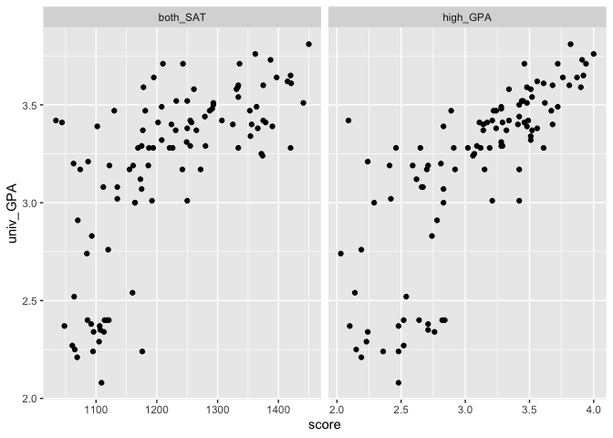
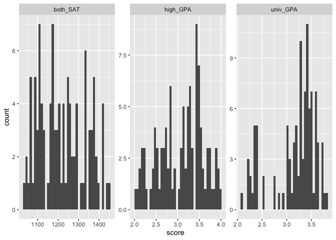
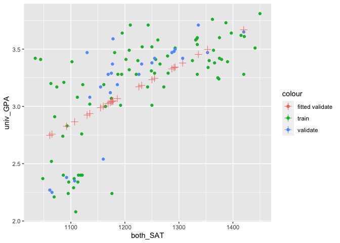

SAT and College Grades
================
Daeyoung Kim
2023-04-19

- <a href="#grading-rubric" id="toc-grading-rubric">Grading Rubric</a>
  - <a href="#individual" id="toc-individual">Individual</a>
  - <a href="#due-date" id="toc-due-date">Due Date</a>
- <a href="#obtain-the-data" id="toc-obtain-the-data">Obtain the Data</a>
  - <a
    href="#q1-visit-the-sat-and-college-gpa-case-study-page-scroll-to-the-bottom-and-click-the-open-data-with-excel-button-this-will-allow-you-to-download-an-xls-file-save-the-file-to-your-data-folder-load-the-data-as-df_sat-and-perform-your-first-checks-against-these-data-answer-the-questions-below"
    id="toc-q1-visit-the-sat-and-college-gpa-case-study-page-scroll-to-the-bottom-and-click-the-open-data-with-excel-button-this-will-allow-you-to-download-an-xls-file-save-the-file-to-your-data-folder-load-the-data-as-df_sat-and-perform-your-first-checks-against-these-data-answer-the-questions-below"><strong>q1</strong>
    Visit the SAT and College GPA case study page, scroll to the bottom, and
    click the <code>Open Data with Excel</code> button. This will allow you
    to download an <code>xls</code> file. Save the file to your
    <code>data</code> folder, load the data as <code>df_sat</code>, and
    perform your “first checks” against these data. Answer the questions
    below:</a>
- <a href="#analysis-with-hypothesis-testing"
  id="toc-analysis-with-hypothesis-testing">Analysis with Hypothesis
  Testing</a>
  - <a href="#view-1-correlations" id="toc-view-1-correlations">View 1:
    Correlations</a>
    - <a
      href="#q2-create-a-single-plot-that-shows-univ_gpa-against-both-high_gpa-and-both_sat-visually-compare-the-two-trends"
      id="toc-q2-create-a-single-plot-that-shows-univ_gpa-against-both-high_gpa-and-both_sat-visually-compare-the-two-trends"><strong>q2</strong>
      Create a <em>single</em> plot that shows <code>univ_GPA</code> against
      <em>both</em> <code>high_GPA</code> and <code>both_SAT</code>. Visually
      compare the two trends.</a>
    - <a href="#hypothesis-testing-with-a-correlation-coefficient"
      id="toc-hypothesis-testing-with-a-correlation-coefficient">Hypothesis
      Testing with a Correlation Coefficient</a>
    - <a
      href="#q3-plot-histograms-for-both_sat-high_gpa-univ_gpa-whichif-anyof-the-variables-look-approximately-normally-distributed"
      id="toc-q3-plot-histograms-for-both_sat-high_gpa-univ_gpa-whichif-anyof-the-variables-look-approximately-normally-distributed"><strong>q3</strong>
      Plot histograms for <code>both_SAT, high_GPA, univ_GPA</code>. Which—if
      any—of the variables look approximately normally distributed.</a>
    - <a
      href="#q4-use-the-function-cortest-to-construct-confidence-intervals-for-corrhigh_gpa-univ_gpa-and-corrboth_sat-univ_gpa-answer-the-questions-below"
      id="toc-q4-use-the-function-cortest-to-construct-confidence-intervals-for-corrhigh_gpa-univ_gpa-and-corrboth_sat-univ_gpa-answer-the-questions-below"><strong>q4</strong>
      Use the function <code>cor.test()</code> to construct confidence
      intervals for <code>corr[high_GPA, univ_GPA</code> and
      <code>corr[both_SAT, univ_GPA]</code>. Answer the questions below.</a>
    - <a
      href="#q5-use-the-bootstrap-to-approximate-a-confidence-interval-for-corrhigh_gpa-univ_gpa-compare-your-resultsboth-the-estimate-and-confidence-intervalto-your-results-from-q4"
      id="toc-q5-use-the-bootstrap-to-approximate-a-confidence-interval-for-corrhigh_gpa-univ_gpa-compare-your-resultsboth-the-estimate-and-confidence-intervalto-your-results-from-q4"><strong>q5</strong>
      Use the bootstrap to approximate a confidence interval for
      <code>corr[high_GPA, univ_GPA</code>. Compare your results—both the
      estimate and confidence interval—to your results from q4.</a>
  - <a href="#view-2-modeling" id="toc-view-2-modeling">View 2: Modeling</a>
    - <a href="#hypothesis-testing-with-a-model"
      id="toc-hypothesis-testing-with-a-model">Hypothesis Testing with a
      Model</a>
    - <a
      href="#q6-fit-a-linear-model-predicting-univ_gpa-with-the-predictor-both_sat-assess-the-model-to-determine-how-effective-a-predictor-both_sat-is-for-univ_gpa-interpret-the-resulting-confidence-interval-for-the-coefficient-on-both_sat"
      id="toc-q6-fit-a-linear-model-predicting-univ_gpa-with-the-predictor-both_sat-assess-the-model-to-determine-how-effective-a-predictor-both_sat-is-for-univ_gpa-interpret-the-resulting-confidence-interval-for-the-coefficient-on-both_sat"><strong>q6</strong>
      Fit a linear model predicting <code>univ_GPA</code> with the predictor
      <code>both_SAT</code>. Assess the model to determine how effective a
      predictor <code>both_SAT</code> is for <code>univ_GPA</code>. Interpret
      the resulting confidence interval for the coefficient on
      <code>both_SAT</code>.</a>
    - <a
      href="#q7-fit-a-model-predicting-univ_gpa-using-both-high_gpa-and-both_sat-compare-the-prediction-accuracy-and-hypothesis-test-results"
      id="toc-q7-fit-a-model-predicting-univ_gpa-using-both-high_gpa-and-both_sat-compare-the-prediction-accuracy-and-hypothesis-test-results"><strong>q7</strong>
      Fit a model predicting <code>univ_GPA</code> using both
      <code>high_GPA</code> and <code>both_SAT</code>. Compare the prediction
      accuracy and hypothesis test results.</a>
  - <a href="#synthesize" id="toc-synthesize">Synthesize</a>
    - <a
      href="#q8-using-the-results-from-all-previous-qs-answer-the-following-questions"
      id="toc-q8-using-the-results-from-all-previous-qs-answer-the-following-questions"><strong>q8</strong>
      Using the results from all previous q’s, answer the following
      questions.</a>
- <a href="#end-notes" id="toc-end-notes">End Notes</a>

*Purpose*: How do we apply hypothesis testing to investigating data? In
this challenge you’ll practice using hypothesis testing tools to make
sense of a dataset.

*Reading*: - [Harvard Study Says SATs Should Be Optional: Here’s
Why](https://www.csmonitor.com/USA/USA-Update/2016/0120/Harvard-study-says-SATs-should-be-optional.-Here-s-why)
(Optional); easy-to-read news article on colleges going SAT-free -
[Norm-Referenced Tests and Race-Blind
Admissions](https://cshe.berkeley.edu/publications/norm-referenced-tests-and-race-blind-admissions-case-eliminating-sat-and-act-university)
(Optional); technical report on relationship between the SAT/ACT and
non-academic factors

*Credit*: This is based on a [case
study](http://onlinestatbook.com/2/case_studies/sat.html) originally
prepared by Emily Zitek, with data collected through the research of
Thomas MacFarland.

``` r
library(tidyverse)
```

    ## ── Attaching core tidyverse packages ──────────────────────── tidyverse 2.0.0 ──
    ## ✔ dplyr     1.1.0     ✔ readr     2.1.4
    ## ✔ forcats   1.0.0     ✔ stringr   1.5.0
    ## ✔ ggplot2   3.4.1     ✔ tibble    3.1.8
    ## ✔ lubridate 1.9.2     ✔ tidyr     1.3.0
    ## ✔ purrr     1.0.1     
    ## ── Conflicts ────────────────────────────────────────── tidyverse_conflicts() ──
    ## ✖ dplyr::filter() masks stats::filter()
    ## ✖ dplyr::lag()    masks stats::lag()
    ## ℹ Use the ]8;;http://conflicted.r-lib.org/conflicted package]8;; to force all conflicts to become errors

``` r
library(readxl)
library(broom)
library(modelr)
```

    ## 
    ## Attaching package: 'modelr'
    ## 
    ## The following object is masked from 'package:broom':
    ## 
    ##     bootstrap

``` r
library(rsample)
```

<!-- include-rubric -->

# Grading Rubric

<!-- -------------------------------------------------- -->

Unlike exercises, **challenges will be graded**. The following rubrics
define how you will be graded, both on an individual and team basis.

## Individual

<!-- ------------------------- -->

| Category    | Needs Improvement                                                                                                | Satisfactory                                                                                                               |
|-------------|------------------------------------------------------------------------------------------------------------------|----------------------------------------------------------------------------------------------------------------------------|
| Effort      | Some task **q**’s left unattempted                                                                               | All task **q**’s attempted                                                                                                 |
| Observed    | Did not document observations, or observations incorrect                                                         | Documented correct observations based on analysis                                                                          |
| Supported   | Some observations not clearly supported by analysis                                                              | All observations clearly supported by analysis (table, graph, etc.)                                                        |
| Assessed    | Observations include claims not supported by the data, or reflect a level of certainty not warranted by the data | Observations are appropriately qualified by the quality & relevance of the data and (in)conclusiveness of the support      |
| Specified   | Uses the phrase “more data are necessary” without clarification                                                  | Any statement that “more data are necessary” specifies which *specific* data are needed to answer what *specific* question |
| Code Styled | Violations of the [style guide](https://style.tidyverse.org/) hinder readability                                 | Code sufficiently close to the [style guide](https://style.tidyverse.org/)                                                 |

## Due Date

<!-- ------------------------- -->

All the deliverables stated in the rubrics above are due **at midnight**
before the day of the class discussion of the challenge. See the
[Syllabus](https://docs.google.com/document/d/1qeP6DUS8Djq_A0HMllMqsSqX3a9dbcx1/edit?usp=sharing&ouid=110386251748498665069&rtpof=true&sd=true)
for more information.

*Background*: Every year about 2 million students take the Scholastic
Aptitude Test (SAT). The exam is
[controversial](http://www.nea.org/home/73288.htm) but [extremely
consequential](https://www.csmonitor.com/2004/0518/p13s01-legn.html).
There are many claims about the SAT, but we’re going to look at just
one: Is the SAT predictive of scholastic performance in college? It
turns out this is a fairly complicated question to assess—we’ll get an
introduction to some of the complexities.

# Obtain the Data

<!-- -------------------------------------------------- -->

### **q1** Visit the [SAT and College GPA](http://onlinestatbook.com/2/case_studies/sat.html) case study page, scroll to the bottom, and click the `Open Data with Excel` button. This will allow you to download an `xls` file. Save the file to your `data` folder, load the data as `df_sat`, and perform your “first checks” against these data. Answer the questions below:

``` r
## TODO:
df_sat <- read_xls("data/sat.xls")

## TODO: Do your "first checks"
df_sat %>% 
  summary()
```

    ##     high_GPA        math_SAT        verb_SAT        comp_GPA    
    ##  Min.   :2.030   Min.   :516.0   Min.   :480.0   Min.   :2.030  
    ##  1st Qu.:2.670   1st Qu.:573.0   1st Qu.:548.0   1st Qu.:2.870  
    ##  Median :3.170   Median :612.0   Median :591.0   Median :3.210  
    ##  Mean   :3.076   Mean   :623.1   Mean   :598.6   Mean   :3.128  
    ##  3rd Qu.:3.480   3rd Qu.:675.0   3rd Qu.:645.0   3rd Qu.:3.490  
    ##  Max.   :4.000   Max.   :718.0   Max.   :732.0   Max.   :4.000  
    ##     univ_GPA    
    ##  Min.   :2.080  
    ##  1st Qu.:3.010  
    ##  Median :3.290  
    ##  Mean   :3.173  
    ##  3rd Qu.:3.470  
    ##  Max.   :3.810

**Observations**:

- Fill in the following “data dictionary”

| Column     | Meaning                                |
|------------|----------------------------------------|
| `high_GPA` | High school grade point average        |
| `math_SAT` | Math SAT score                         |
| `verb_SAT` | Verbal SAT score                       |
| `comp_GPA` | Computer science grade point average   |
| `univ_GPA` | Overall university grade point average |

- What information do we have about these students?
  - We have information about their high school GPA, SAT score for each
    section, computer science GPA, and overall university GPA. From the
    website, it says: “This study examines the SAT and GPA information
    of 105 students who graduated from a state university with a B.S. in
    computer science.”
- What kinds of information *do we not have* about these students?
  - We don’t know which colleges the surveyed students go, which year
    they graduated, the rigor of the university/high school they
    attended, what kind of classes qualified as a computer science
    class, and etc.
- Based on these missing variables, what possible effects could be
  present in the data that we would have *no way of detecting*?
  - Since the only common factor between the surveyees is that they
    graduated with a computer science degree with an SAT score, there
    might be a big gaps between their environments that affected their
    GPA and SAT scores.

# Analysis with Hypothesis Testing

<!-- ----------------------------------------------------------------------- -->

We’re going to use two complementary approaches to analyze the data, the
first based on hypothesis testing of correlation coefficients, and the
second based on fitting a regression model and interpreting the
regression coefficients.

To simplify the analysis, let’s look at a composite SAT score:

``` r
## NOTE: No need to edit this
df_composite <-
  df_sat %>%
  mutate(both_SAT = math_SAT + verb_SAT)

df_composite
```

    ## # A tibble: 105 × 6
    ##    high_GPA math_SAT verb_SAT comp_GPA univ_GPA both_SAT
    ##       <dbl>    <dbl>    <dbl>    <dbl>    <dbl>    <dbl>
    ##  1     3.45      643      589     3.76     3.52     1232
    ##  2     2.78      558      512     2.87     2.91     1070
    ##  3     2.52      583      503     2.54     2.4      1086
    ##  4     3.67      685      602     3.83     3.47     1287
    ##  5     3.24      592      538     3.29     3.47     1130
    ##  6     2.1       562      486     2.64     2.37     1048
    ##  7     2.82      573      548     2.86     2.4      1121
    ##  8     2.36      559      536     2.03     2.24     1095
    ##  9     2.42      552      583     2.81     3.02     1135
    ## 10     3.51      617      591     3.41     3.32     1208
    ## # … with 95 more rows

## View 1: Correlations

<!-- ----------------------------------------------------------------------- -->

### **q2** Create a *single* plot that shows `univ_GPA` against *both* `high_GPA` and `both_SAT`. Visually compare the two trends.

*Hint*: One way to do this is to first *pivot* `df_composite`.

``` r
df_composite %>% 
  pivot_longer(
    cols = c(high_GPA, both_SAT),
    names_to = "variables",
    values_to = "score"
  ) %>% 
  ggplot(aes(score, univ_GPA)) +
  geom_point() +
  facet_wrap(.~variables, scales = 'free_x')
```

<!-- -->

**Observations**:

- What relationship do `univ_GPA` and `both_SAT` exhibit?
  - They’re generally positively related, but the relationship is vague,
    particularly at SAT scores around 1100.
- What relationship do `univ_GPA` and `high_GPA` exhibit?
  - They’re are also generally positively related, but at the lower end
    of `high_GPA`, the relationship is less clear – the range of
    `univ_GPA` is large and less predictable. But it seems to have a
    greater impact on `univ_GPA` than `both_SAT`.

### Hypothesis Testing with a Correlation Coefficient

<!-- ------------------------- -->

We can use the idea of hypothesis testing with a correlation
coefficient. The idea is to set our null hypothesis to the case where
there is no correlation, and test to see if the data contradict that
perspective. Formally, the null (H0) and alternative (HA) hypotheses
relating to a correlation coefficient between two variables `X, Y` are:

$$\text{H0: } \text{Corr}[X, Y] = 0$$

$$\text{HA: } \text{Corr}[X, Y] \neq 0$$

The R function `cor.test` implements such a hypothesis test under the
assumption that `X, Y` are both normally distributed. First, let’s check
to see if this assumption looks reasonable for our data.

### **q3** Plot histograms for `both_SAT, high_GPA, univ_GPA`. Which—if any—of the variables look approximately normally distributed.

``` r
df_composite %>% 
  pivot_longer(
    cols = c(both_SAT, high_GPA, univ_GPA),
    names_to = "variable",
    values_to = "score"
  ) %>% 
  ggplot() + 
  geom_histogram(aes(score), bins = 40) + 
  facet_wrap(.~variable, scale = 'free')
```

<!-- -->

**Observations**:

- To what extent does `both_SAT` look like a normal distribution?
  - It has a slight right skew, but somewhat normal.
- To what extent does `high_GPA` look like a normal distribution?
  - It has a high peak around 3.5 GPA but it looks normal-ish otherwise.
- To what extent does `univ_GPA` look like a normal distribution?
  - It’s the least normal appearing out of the three.

Keep in mind your findings as you complete q4.

### **q4** Use the function `cor.test()` to construct confidence intervals for `corr[high_GPA, univ_GPA` and `corr[both_SAT, univ_GPA]`. Answer the questions below.

``` r
## TODO: Use the function cor.test() to test the correlations between
##       high_GPA and univ_GPA, as well as between
##       both_SAT and univ_GPA
x <- df_composite %>% pull(high_GPA)
y <- df_composite %>% pull(univ_GPA)

high_univ_GPA <- cor.test(x, y) %>% tidy()

x <- df_composite %>% pull(both_SAT)
y <- df_composite %>% pull(univ_GPA)

SAT_univ_GPA <- cor.test(x, y) %>% tidy()


cbind(as.data.frame(t(high_univ_GPA)), as.data.frame(t(SAT_univ_GPA))) %>% 
  rename(c(high_univ_GPA = 1, SAT_univ_GPA = 2))
```

    ##                                    high_univ_GPA
    ## estimate                               0.7795631
    ## statistic                               12.63197
    ## p.value                             1.175613e-22
    ## parameter                                    103
    ## conf.low                                0.691169
    ## conf.high                              0.8449761
    ## method      Pearson's product-moment correlation
    ## alternative                            two.sided
    ##                                     SAT_univ_GPA
    ## estimate                               0.6846776
    ## statistic                               9.533862
    ## p.value                             8.051987e-16
    ## parameter                                    103
    ## conf.low                               0.5674824
    ## conf.high                              0.7746821
    ## method      Pearson's product-moment correlation
    ## alternative                            two.sided

**Observations**:

- Which correlations are significantly nonzero?
  - Both of the correlation values are significantly nonzero.
- Which of `high_GPA` and `both_SAT` seems to be more strongly
  correlated with `univ_GPA`?
  - `high_GPA` seem to be have stronger correlation to `univ_GPA`, since
    the confidence interval is narrower and the estimate is also about
    0.1 higher than that of `both_SAT`.
- How do the results here compare with the visual you created in q2?
  - They seem to be in line with the visual I created and the
    interpretations of it.
- Based on these results, what can we say about the predictive
  capabilities of both `high_GPA` and `both_SAT` to predict `univ_GPA`?
  - For now, it seems like `high_GPA` is a better predictor than
    `both_SAT` but the sample size is too small to make a definitive
    conclusion.

Finally, let’s use the bootstrap to perform the same test using
*different* assumptions.

### **q5** Use the bootstrap to approximate a confidence interval for `corr[high_GPA, univ_GPA`. Compare your results—both the estimate and confidence interval—to your results from q4.

``` r
## TODO: Use the bootstrap to compute a confidence interval for corr[high_GPA, univ_GPA]
corr_high_GPA <- function(split) {
  df <- analysis(split)
  
  tibble(
    term = "cor",
    estimate = cor(df$high_GPA, df$univ_GPA)
  )
}

## Use the bootstrap to approximate a CI
df_composite %>%
  bootstraps(times = 1000) %>%
  mutate(estimates = map(splits, corr_high_GPA))  %>%
  int_pctl(estimates)
```

    ## # A tibble: 1 × 6
    ##   term  .lower .estimate .upper .alpha .method   
    ##   <chr>  <dbl>     <dbl>  <dbl>  <dbl> <chr>     
    ## 1 cor    0.693     0.778  0.851   0.05 percentile

**Observations**:

- How does your estimate from q5 compare with your estimate from q4?
  - The estimate of about 0.7800 is very similar to about 0.77956 which
    was the estimate from q4.
- How does your CI from q5 compare with your CI from q4?
  - The CI is also very similar – about 0.70 to 0.85 vs 0.69 to 0.84.

*Aside*: When you use two different approximations to compute the same
quantity and get similar results, that’s an *encouraging sign*. Such an
outcome lends a bit more credibility to the results.

## View 2: Modeling

<!-- ------------------------- -->

Correlations are useful for relating two variables at a time. To study
the relationship among more variables we can instead use a fitted model.
Using a model, we can also help assess whether it is *worthwhile* to
measure a variable.

To begin, let’s first split the data into training and validation sets.

``` r
## NOTE: No need to edit
set.seed(101)

df_train <-
  df_composite %>%
  rowid_to_column() %>%
  slice_sample(n = 80)

df_validate <-
  df_composite %>%
  rowid_to_column() %>%
  anti_join(
    .,
    df_train,
    by = "rowid"
  )
```

### Hypothesis Testing with a Model

<!-- ------------------------- -->

We can combine the ideas of hypothesis testing with a model. Using a
model, we can express our hypotheses in terms of the model parameters.
For instance, if we were interested in whether $X$ has an affect on $Y$,
we might set up a model:

$$Y_i = \beta X_i + \epsilon_i$$

With the hypotheses:

$$\text{H0}: \beta = 0$$

$$\text{HA}: \beta \neq 0$$

In this case, we’re testing for whether $X$ has a significant effect on
$Y$. Let’s apply this idea to relating the variables `univ_GPA` and
`high_GPA`. Luckily R has built-in tools to construct a confidence
interval on the $\beta$’s in a regression \[1\]; we’ll simply use those
tools rather than do it by hand.

### **q6** Fit a linear model predicting `univ_GPA` with the predictor `both_SAT`. Assess the model to determine how effective a predictor `both_SAT` is for `univ_GPA`. Interpret the resulting confidence interval for the coefficient on `both_SAT`.

``` r
## TODO: Fit a model of univ_GPA on the predictor both_SAT
fit_basic <- 
  lm(
    data = df_train,
    formula = univ_GPA ~ both_SAT
  )

## NOTE: The following computes confidence intervals on regression coefficients
fit_basic %>%
  tidy(
    conf.int = TRUE,
    conf.level = 0.99
  )
```

    ## # A tibble: 2 × 7
    ##   term        estimate std.error statistic  p.value conf.low conf.high
    ##   <chr>          <dbl>     <dbl>     <dbl>    <dbl>    <dbl>     <dbl>
    ## 1 (Intercept)  0.0260   0.396       0.0655 9.48e- 1 -1.02      1.07   
    ## 2 both_SAT     0.00257  0.000322    7.97   1.08e-11  0.00172   0.00342

``` r
mse(fit_basic, df_validate)
```

    ## [1] 0.09188292

``` r
new <- df_validate %>% select(both_SAT)

ggplot(df_train, aes(both_SAT, univ_GPA)) +
  geom_point(aes(color = "train")) +
  geom_point(data = df_validate, aes(color = "validate")) +
  geom_point(data = df_validate, aes(x = both_SAT, y = predict(fit_basic, new), color = "fitted validate"), shape = 3, size = 3)
```

<!-- -->

**Observations**:

- What is the confidence interval on the coefficient of `both_SAT`? Is
  this coefficient significantly different from zero?
  - The confidence interval is from about 0.0017 to 0.0034. The
    coefficient is significantly different from zero.
- By itself, how well does `both_SAT` predict `univ_GPA`?
  - It seems to be able to predict the general trend but the error is
    pretty large in predicting `univ_GPA`.

Remember from `e-model03-interp-warnings` that there are challenges with
interpreting regression coefficients! Let’s investigate that idea
further.

### **q7** Fit a model predicting `univ_GPA` using both `high_GPA` and `both_SAT`. Compare the prediction accuracy and hypothesis test results.

``` r
## TODO: Fit and assess models with predictors both_SAT + high_GPA, and high_GPA alone

fit_high_GPA <- 
  lm(
    data = df_train,
    formula = univ_GPA ~ high_GPA
  )
fit_high_GPA %>% 
  tidy(
    conf.int = TRUE,
    conf.level = 0.99
  )
```

    ## # A tibble: 2 × 7
    ##   term        estimate std.error statistic  p.value conf.low conf.high
    ##   <chr>          <dbl>     <dbl>     <dbl>    <dbl>    <dbl>     <dbl>
    ## 1 (Intercept)    1.12     0.193       5.78 1.45e- 7    0.606     1.63 
    ## 2 high_GPA       0.667    0.0617     10.8  3.79e-17    0.504     0.830

``` r
fit_composite <- 
  lm(
    data = df_train,
    formula = univ_GPA ~ both_SAT + high_GPA
  )

fit_composite %>% 
  tidy(
    conf.int = TRUE,
    conf.level = 0.99
  )
```

    ## # A tibble: 3 × 7
    ##   term        estimate std.error statistic     p.value  conf.low conf.high
    ##   <chr>          <dbl>     <dbl>     <dbl>       <dbl>     <dbl>     <dbl>
    ## 1 (Intercept) 0.758     0.362         2.09 0.0397      -0.199      1.71   
    ## 2 both_SAT    0.000534  0.000457      1.17 0.247       -0.000674   0.00174
    ## 3 high_GPA    0.570     0.103         5.55 0.000000396  0.299      0.842

``` r
mse(fit_basic, df_validate)
```

    ## [1] 0.09188292

``` r
mse(fit_high_GPA, df_validate)
```

    ## [1] 0.07039965

``` r
mse(fit_composite, df_validate)
```

    ## [1] 0.06359633

**Observations**:

- How well do these models perform, compared to the one you built in q6?
  - The model with two features performs the best, followed by model
    with `high_GPA` and then `both_SAT` – the mean-squared-errors are
    smallest to largest respectively. However, the confidence interval
    is much bigger for `high_GPA` when using both features in the model
    ranging from about 0.30 to 0.84 while the model with just `high_GPA`
    had an interval of about 0.50 to 0.83. The p-value for `both_SAT` in
    the model for both features is significantly larger than the that
    from q6.
- What is the confidence interval on the coefficient of `both_SAT` when
  including `high_GPA` as a predictor?? Is this coefficient
  significantly different from zero?
  - The confidence interval is from about -0.00067 to 0.0017, including
    0 in its interval. The coefficient is 0.00053, which is a very small
    value close to 0.
- How do the hypothesis test results compare with the results in q6?
  - `high_GPA` has a coefficient significantly different from 0, which
    rejects the null hypothesis. With both `high_GPA` and `both_SAT` as
    predictors, `both_SAT` seemed to have much smaller influence on
    `univ_GPA`. It also had a much larger p-value of about 0.25, which
    questions its statistical significance. It did not reject the null
    hypothesis unlike the results in q6.

## Synthesize

<!-- ------------------------- -->

Before closing, let’s synthesize a bit from the analyses above.

### **q8** Using the results from all previous q’s, answer the following questions.

**Observations**:

- Between `both_SAT` and `high_GPA`, which single variable would you
  choose to predict `univ_GPA`? Why?
  - I would choose `high_GPA` to predict `univ_GPA`. The correlation
    coefficient is larger with `univ_GPA` and the regression model’s
    mean-squared-error is smaller for `high_GPA` than fitted with
    `both_SAT`. The coefficients when both features were included in the
    formula for the model were much bigger for `high_GPA` than for
    `both_SAT` even considering the magnitude of the typical values –
    using theoretical values of GPA and SAT score, it shows that 0.57 \*
    3 = 1.71 using coefficient for `high_GPA` and 0.00053 \* 1200 =
    0.636 using coefficient for `both_SAT`.
- Is `both_SAT` an effective predictor of `univ_GPA`? What specific
  pieces of evidence do you have in favor of `both_SAT` being effective?
  What specific pieces of evidence do you have against?
  - The correlation coefficient of about 0.68 is quite large, which
    suggests `both_SAT` as an effective predictor. The scatter plot of
    `both_SAT` and `univ_GPA` showed a weak correlation at lower SAT
    scores and stronger correlation at higher SAT scores. The linear
    model with `both_SAT` and `high_GPA` showed a relatively much
    smaller coefficient for `both_SAT` than that for `high_GPA`, which
    shows that it’s a less influential predictor than `high_GPA`. It
    also had a large p-value for `both_SAT` in the model with both
    features which suggests that the results might be due to chance.

# End Notes

<!-- ----------------------------------------------------------------------- -->

\[1\] There are also assumptions underlying this kind of testing, for
more information see this [Wiki
article](https://en.wikipedia.org/wiki/Linear_regression#Assumptions).
