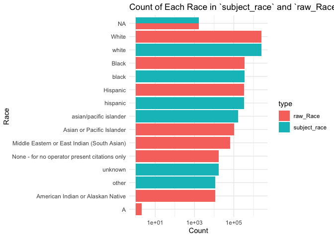
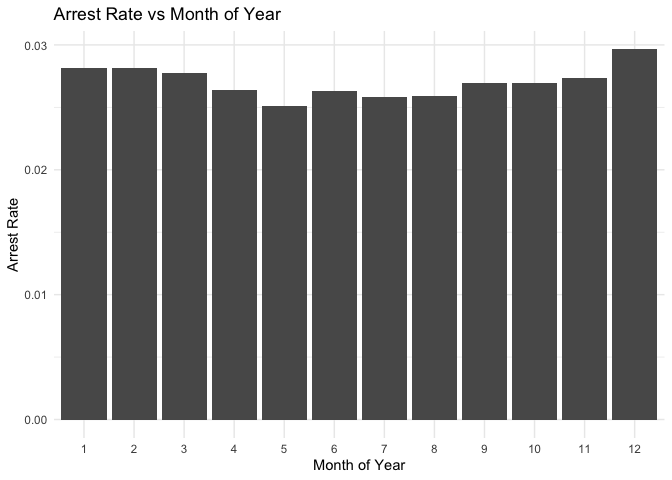
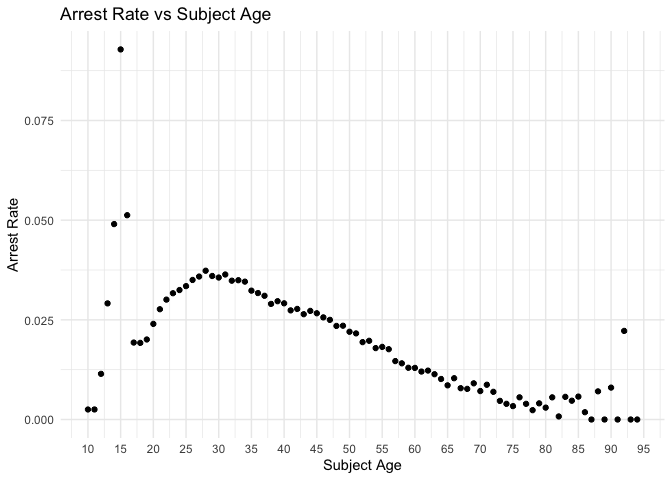
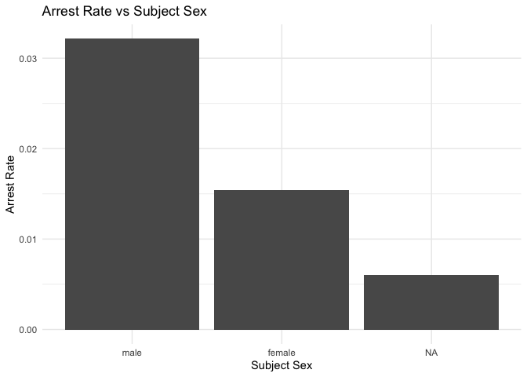
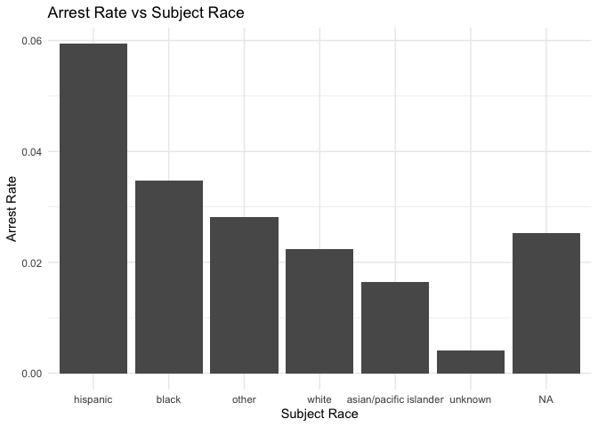
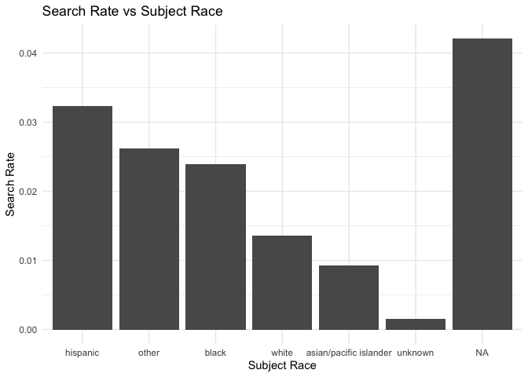

Massachusetts Highway Stops
================
Daeyoung Kim
2023-05-03

- <a href="#grading-rubric" id="toc-grading-rubric">Grading Rubric</a>
  - <a href="#individual" id="toc-individual">Individual</a>
  - <a href="#due-date" id="toc-due-date">Due Date</a>
- <a href="#setup" id="toc-setup">Setup</a>
  - <a
    href="#q1-go-to-the-stanford-open-policing-project-page-and-download-the-massachusetts-state-police-records-in-rds-format-move-the-data-to-your-data-folder-and-match-the-filename-to-load-the-data"
    id="toc-q1-go-to-the-stanford-open-policing-project-page-and-download-the-massachusetts-state-police-records-in-rds-format-move-the-data-to-your-data-folder-and-match-the-filename-to-load-the-data"><strong>q1</strong>
    Go to the Stanford Open Policing Project page and download the
    Massachusetts State Police records in <code>Rds</code> format. Move the
    data to your <code>data</code> folder and match the
    <code>filename</code> to load the data.</a>
- <a href="#eda" id="toc-eda">EDA</a>
  - <a
    href="#q2-do-your-first-checks-on-the-dataset-what-are-the-basic-facts-about-this-dataset"
    id="toc-q2-do-your-first-checks-on-the-dataset-what-are-the-basic-facts-about-this-dataset"><strong>q2</strong>
    Do your “first checks” on the dataset. What are the basic facts about
    this dataset?</a>
  - <a
    href="#q3-check-the-set-of-factor-levels-for-subject_race-and-raw_race-what-do-you-note-about-overlap--difference-between-the-two-sets"
    id="toc-q3-check-the-set-of-factor-levels-for-subject_race-and-raw_race-what-do-you-note-about-overlap--difference-between-the-two-sets"><strong>q3</strong>
    Check the set of factor levels for <code>subject_race</code> and
    <code>raw_Race</code>. What do you note about overlap / difference
    between the two sets?</a>
  - <a
    href="#q4-check-whether-subject_race-and-raw_race-match-for-a-large-fraction-of-cases-which-of-the-two-hypotheses-above-is-most-likely-based-on-your-results"
    id="toc-q4-check-whether-subject_race-and-raw_race-match-for-a-large-fraction-of-cases-which-of-the-two-hypotheses-above-is-most-likely-based-on-your-results"><strong>q4</strong>
    Check whether <code>subject_race</code> and <code>raw_Race</code> match
    for a large fraction of cases. Which of the two hypotheses above is most
    likely, based on your results?</a>
  - <a href="#vis" id="toc-vis">Vis</a>
    - <a
      href="#q5-compare-the-arrest-ratethe-fraction-of-total-cases-in-which-the-subject-was-arrestedacross-different-factors-create-as-many-visuals-or-tables-as-you-need-but-make-sure-to-check-the-trends-across-all-of-the-subject-variables-answer-the-questions-under-observations-below"
      id="toc-q5-compare-the-arrest-ratethe-fraction-of-total-cases-in-which-the-subject-was-arrestedacross-different-factors-create-as-many-visuals-or-tables-as-you-need-but-make-sure-to-check-the-trends-across-all-of-the-subject-variables-answer-the-questions-under-observations-below"><strong>q5</strong>
      Compare the <em>arrest rate</em>—the fraction of total cases in which
      the subject was arrested—across different factors. Create as many
      visuals (or tables) as you need, but make sure to check the trends
      across all of the <code>subject</code> variables. Answer the questions
      under <em>observations</em> below.</a>
- <a href="#modeling" id="toc-modeling">Modeling</a>
  - <a
    href="#q6-run-the-following-code-and-interpret-the-regression-coefficients-answer-the-the-questions-under-observations-below"
    id="toc-q6-run-the-following-code-and-interpret-the-regression-coefficients-answer-the-the-questions-under-observations-below"><strong>q6</strong>
    Run the following code and interpret the regression coefficients. Answer
    the the questions under <em>observations</em> below.</a>
  - <a
    href="#q7-re-fit-the-logistic-regression-from-q6-setting-white-as-the-reference-level-for-subject_race-interpret-the-the-model-terms-and-answer-the-questions-below"
    id="toc-q7-re-fit-the-logistic-regression-from-q6-setting-white-as-the-reference-level-for-subject_race-interpret-the-the-model-terms-and-answer-the-questions-below"><strong>q7</strong>
    Re-fit the logistic regression from q6 setting <code>"white"</code> as
    the reference level for <code>subject_race</code>. Interpret the the
    model terms and answer the questions below.</a>
  - <a
    href="#q8-re-fit-the-model-using-a-factor-indicating-the-presence-of-contraband-in-the-subjects-vehicle-answer-the-questions-under-observations-below"
    id="toc-q8-re-fit-the-model-using-a-factor-indicating-the-presence-of-contraband-in-the-subjects-vehicle-answer-the-questions-under-observations-below"><strong>q8</strong>
    Re-fit the model using a factor indicating the presence of contraband in
    the subject’s vehicle. Answer the questions under <em>observations</em>
    below.</a>
  - <a
    href="#q9-go-deeper-pose-at-least-one-more-question-about-the-data-and-fit-at-least-one-more-model-in-support-of-answering-that-question"
    id="toc-q9-go-deeper-pose-at-least-one-more-question-about-the-data-and-fit-at-least-one-more-model-in-support-of-answering-that-question"><strong>q9</strong>
    Go deeper: Pose at least one more question about the data and fit at
    least one more model in support of answering that question.</a>
  - <a href="#further-reading" id="toc-further-reading">Further Reading</a>

*Purpose*: In this last challenge we’ll focus on using logistic
regression to study a large, complicated dataset. Interpreting the
results of a model can be challenging—both in terms of the statistics
and the real-world reasoning—so we’ll get some practice in this
challenge.

<!-- include-rubric -->

# Grading Rubric

<!-- -------------------------------------------------- -->

Unlike exercises, **challenges will be graded**. The following rubrics
define how you will be graded, both on an individual and team basis.

## Individual

<!-- ------------------------- -->

| Category    | Needs Improvement                                                                                                | Satisfactory                                                                                                               |
|-------------|------------------------------------------------------------------------------------------------------------------|----------------------------------------------------------------------------------------------------------------------------|
| Effort      | Some task **q**’s left unattempted                                                                               | All task **q**’s attempted                                                                                                 |
| Observed    | Did not document observations, or observations incorrect                                                         | Documented correct observations based on analysis                                                                          |
| Supported   | Some observations not clearly supported by analysis                                                              | All observations clearly supported by analysis (table, graph, etc.)                                                        |
| Assessed    | Observations include claims not supported by the data, or reflect a level of certainty not warranted by the data | Observations are appropriately qualified by the quality & relevance of the data and (in)conclusiveness of the support      |
| Specified   | Uses the phrase “more data are necessary” without clarification                                                  | Any statement that “more data are necessary” specifies which *specific* data are needed to answer what *specific* question |
| Code Styled | Violations of the [style guide](https://style.tidyverse.org/) hinder readability                                 | Code sufficiently close to the [style guide](https://style.tidyverse.org/)                                                 |

## Due Date

<!-- ------------------------- -->

All the deliverables stated in the rubrics above are due **at midnight**
before the day of the class discussion of the challenge. See the
[Syllabus](https://docs.google.com/document/d/1qeP6DUS8Djq_A0HMllMqsSqX3a9dbcx1/edit?usp=sharing&ouid=110386251748498665069&rtpof=true&sd=true)
for more information.

*Background*: We’ll study data from the [Stanford Open Policing
Project](https://openpolicing.stanford.edu/data/), specifically their
dataset on Massachusetts State Patrol police stops.

``` r
library(tidyverse)
```

    ## ── Attaching core tidyverse packages ──────────────────────── tidyverse 2.0.0 ──
    ## ✔ dplyr     1.1.0     ✔ readr     2.1.4
    ## ✔ forcats   1.0.0     ✔ stringr   1.5.0
    ## ✔ ggplot2   3.4.1     ✔ tibble    3.1.8
    ## ✔ lubridate 1.9.2     ✔ tidyr     1.3.0
    ## ✔ purrr     1.0.1     
    ## ── Conflicts ────────────────────────────────────────── tidyverse_conflicts() ──
    ## ✖ dplyr::filter() masks stats::filter()
    ## ✖ dplyr::lag()    masks stats::lag()
    ## ℹ Use the ]8;;http://conflicted.r-lib.org/conflicted package]8;; to force all conflicts to become errors

``` r
library(broom)
```

# Setup

<!-- -------------------------------------------------- -->

### **q1** Go to the [Stanford Open Policing Project](https://openpolicing.stanford.edu/data/) page and download the Massachusetts State Police records in `Rds` format. Move the data to your `data` folder and match the `filename` to load the data.

*Note*: An `Rds` file is an R-specific file format. The function
`readRDS` will read these files.

``` r
## TODO: Download the data, move to your data folder, and load it
filename <- "data/policing_ma_statewide_2020_04_01.rds"
df_data <- readRDS(filename)
```

# EDA

<!-- -------------------------------------------------- -->

### **q2** Do your “first checks” on the dataset. What are the basic facts about this dataset?

``` r
df_data %>% colnames()
```

    ##  [1] "raw_row_number"             "date"                      
    ##  [3] "location"                   "county_name"               
    ##  [5] "subject_age"                "subject_race"              
    ##  [7] "subject_sex"                "type"                      
    ##  [9] "arrest_made"                "citation_issued"           
    ## [11] "warning_issued"             "outcome"                   
    ## [13] "contraband_found"           "contraband_drugs"          
    ## [15] "contraband_weapons"         "contraband_alcohol"        
    ## [17] "contraband_other"           "frisk_performed"           
    ## [19] "search_conducted"           "search_basis"              
    ## [21] "reason_for_stop"            "vehicle_type"              
    ## [23] "vehicle_registration_state" "raw_Race"

- According to the source website, the dataset includes MA state patrol
  policing data in Dec 2006 - Dec 2015.
- `Stop Date`, `Stop Location`, `Driver Race`, `Driver Sex`,
  `Driver Age`, `Search Conducted`, `Contraband Found`,
  `Citation Issued`, `Warning Issued`, and `Arrest Made` were the
  information said to be available in the website.
- The column names of the dataset generally matches the fields
  described.

Note that we have both a `subject_race` and `race_Raw` column. There are
a few possibilities as to what `race_Raw` represents:

- `race_Raw` could be the race of the police officer in the stop
- `race_Raw` could be an unprocessed version of `subject_race`

Let’s try to distinguish between these two possibilities.

### **q3** Check the set of factor levels for `subject_race` and `raw_Race`. What do you note about overlap / difference between the two sets?

``` r
## TODO: Determine the factor levels for subject_race and raw_Race
df_data %>% 
  summarize(
    raw_Race = as.factor(raw_Race)
  ) %>% 
  unique()
```

    ## # A tibble: 9 × 1
    ##   raw_Race                                     
    ##   <fct>                                        
    ## 1 White                                        
    ## 2 Hispanic                                     
    ## 3 Black                                        
    ## 4 Asian or Pacific Islander                    
    ## 5 Middle Eastern or East Indian (South Asian)  
    ## 6 American Indian or Alaskan Native            
    ## 7 <NA>                                         
    ## 8 None - for no operator present citations only
    ## 9 A

``` r
df_data %>% 
  summarize(
    subject_race = as.factor(subject_race)
  ) %>% 
  unique()
```

    ## # A tibble: 7 × 1
    ##   subject_race          
    ##   <fct>                 
    ## 1 white                 
    ## 2 hispanic              
    ## 3 black                 
    ## 4 asian/pacific islander
    ## 5 other                 
    ## 6 <NA>                  
    ## 7 unknown

**Observations**:

- What are the unique values for `subject_race`?
  - `white`
  - `hispanic`
  - `black`
  - `asian/pacific islander`
  - `other`
  - `NA`
  - `unknown`
- What are the unique values for `raw_Race`?
  - `White`  
  - `Hispanic`  
  - `Black`  
  - `Asian or Pacific Islander`  
  - `Middle Eastern or East Indian (South Asian)`  
  - `American Indian or Alaskan Native`  
  - `NA`  
  - `None - for no operator present citations only`  
  - `A`
- What is the overlap between the two sets?
  - `white`
  - `hispanic`
  - `black`
  - `asian/pacific islander`
  - `NA`
- What is the difference between the two sets?
  - `Middle Eastern or East Indian (South Asian)`,
    `American Indian or Alaskan Native`,
    `None - for no operator present citations only`, `A` are not present
    in the `subject_race`. Conversely, `unknown` is not present in the
    `raw_Race`.

### **q4** Check whether `subject_race` and `raw_Race` match for a large fraction of cases. Which of the two hypotheses above is most likely, based on your results?

*Note*: Just to be clear, I’m *not* asking you to do a *statistical*
hypothesis test.

``` r
## TODO: Devise your own way to test the hypothesis posed above.
df_data %>% 
  mutate(
    subject_race = as.factor(subject_race),
    raw_Race = as.factor(raw_Race)
  ) %>% 
  select(c(subject_race, raw_Race)) %>% 
  pivot_longer(
    cols = everything(),
    names_to = "type",
    values_to = "race"
  ) %>% 
  group_by(type, race) %>% 
  summarize(count = n()) %>% 
  ggplot(aes(fct_reorder(race, count), count)) +
  geom_col(aes(group = type, fill = type), position = "dodge") +
  scale_y_log10() +
  # facet_wrap(~type, scales = 'free_y') +
  coord_flip() + 
  theme_minimal() +
  labs(
    x = "Race",
    y = "Count",
    title = "Count of Each Race in `subject_race` and `raw_Race`"
  )
```

<!-- -->

**Observations**

Between the two hypotheses:

- `race_Raw` could be the race of the police officer in the stop
- `race_Raw` could be an unprocessed version of `subject_race`

which is most plausible, based on your results?

- `race_Raw` seems to be an unprocessed version of `subject_race`. The
  counts of each category matches up approximately either when by
  themselves or when grouped together in an overarching category.

## Vis

<!-- ------------------------- -->

### **q5** Compare the *arrest rate*—the fraction of total cases in which the subject was arrested—across different factors. Create as many visuals (or tables) as you need, but make sure to check the trends across all of the `subject` variables. Answer the questions under *observations* below.

(Note: Create as many chunks and visuals as you need)

``` r
df_data_arrest <- 
df_data %>% 
  # filter any NA since we don't know what the actual outcome was
  filter(!is.na(arrest_made))

df_data_arrest %>% 
  mutate(month = lubridate::month(date)) %>%
  group_by(month) %>% 
  summarize(arrest_rate = mean(arrest_made)) %>% 
  
  ggplot(aes(as.factor(month), arrest_rate)) +
  geom_col() + 
  theme_minimal() +
  labs(
    x = "Month of Year",
    y = "Arrest Rate",
    title = "Arrest Rate vs Month of Year"
  )
```

<!-- -->

``` r
df_data_arrest %>% 
  group_by(subject_age) %>% 
  summarize(arrest_rate = mean(arrest_made)) %>% 
  
  ggplot(aes(subject_age, arrest_rate)) +
  geom_point() +
  scale_x_continuous(breaks = seq(0, 100, by = 5)) + 
  theme_minimal() +
  labs(
    x = "Subject Age",
    y = "Arrest Rate",
    title = "Arrest Rate vs Subject Age"
  )
```

    ## Warning: Removed 1 rows containing missing values (`geom_point()`).

<!-- -->

``` r
df_data_arrest %>% 
  group_by(subject_sex) %>% 
  summarize(arrest_rate = mean(arrest_made)) %>% 
  
  ggplot(aes(subject_sex, arrest_rate)) +
  geom_col() + 
  theme_minimal() +
  labs(
    x = "Subject Sex",
    y = "Arrest Rate",
    title = "Arrest Rate vs Subject Sex"
  )
```

<!-- -->

``` r
df_data_arrest %>% 
  group_by(subject_race) %>% 
  summarize(arrest_rate = mean(arrest_made)) %>% 
  
  ggplot(aes(fct_reorder(as.factor(subject_race), arrest_rate, desc), arrest_rate)) +
  geom_col() + 
  theme_minimal() +
  labs(
    x = "Subject Race",
    y = "Arrest Rate",
    title = "Arrest Rate vs Subject Race"
  )
```

<!-- -->

**Observations**:

- How does `arrest_rate` tend to vary with `subject_age`?
  - `arrest_rate` tends to increase up until late 20’s and then
    gradually decrease as the subject gets older. However, there are
    some outstanding `arrest_rate` in some ages in the 10’s and the
    90’s.
- How does `arrest_rate` tend to vary with `subject_sex`?
  - `arrest_rate` is much higher for `male` than `female`. But there are
    15619 rows with NA that has a very low `arrest_rate`, so it’s hard
    to definitively conclude the trend in `subject_sex`.
- How does `arrest_rate` tend to vary with `subject_race`?
  - `arrest_rate` is significantly higher for `hispanic` compared to
    other racial groups and also the average arrest_rate (about 0.0269),
    and then the rest in the order of `black`, `other`, `white`,
    `asian/pacific islander`, `unknown`.

# Modeling

<!-- -------------------------------------------------- -->

We’re going to use a model to study the relationship between `subject`
factors and arrest rate, but first we need to understand a bit more
about *dummy variables*

### **q6** Run the following code and interpret the regression coefficients. Answer the the questions under *observations* below.

``` r
## NOTE: No need to edit; inspect the estimated model terms.
fit_q6 <-
  glm(
    formula = arrest_made ~ subject_age + subject_race + subject_sex,
    data = df_data %>%
      filter(
        !is.na(arrest_made),
        subject_race %in% c("white", "black", "hispanic")
      ),
    family = "binomial"
  )

fit_q6 %>% tidy()
```

    ## # A tibble: 5 × 5
    ##   term                 estimate std.error statistic   p.value
    ##   <chr>                   <dbl>     <dbl>     <dbl>     <dbl>
    ## 1 (Intercept)           -2.67    0.0132      -202.  0        
    ## 2 subject_age           -0.0142  0.000280     -50.5 0        
    ## 3 subject_racehispanic   0.513   0.0119        43.3 0        
    ## 4 subject_racewhite     -0.380   0.0103       -37.0 3.12e-299
    ## 5 subject_sexfemale     -0.755   0.00910      -83.0 0

**Observations**:

- Which `subject_race` levels are included in fitting the model?
  - `white`, `black`, and `hispanic`.
- Which `subject_race` levels have terms in the model?
  - `hispanic` and `white` only.

You should find that each factor in the model has a level *missing* in
its set of terms. This is because R represents factors against a
*reference level*: The model treats one factor level as “default”, and
each factor model term represents a change from that “default” behavior.
For instance, the model above treats `subject_sex==male` as the
reference level, so the `subject_sexfemale` term represents the *change
in probability* of arrest due to a person being female (rather than
male).

The this reference level approach to coding factors is necessary for
[technical
reasons](https://www.andrew.cmu.edu/user/achoulde/94842/lectures/lecture10/lecture10-94842.html#why-is-one-of-the-levels-missing-in-the-regression),
but it complicates interpreting the model results. For instance; if we
want to compare two levels, neither of which are the reference level, we
have to consider the difference in their model coefficients. But if we
want to compare all levels against one “baseline” level, then we can
relevel the data to facilitate this comparison.

By default `glm` uses the first factor level present as the reference
level. Therefore we can use
`mutate(factor = fct_relevel(factor, "desired_level"))` to set our
`"desired_level"` as the reference factor.

### **q7** Re-fit the logistic regression from q6 setting `"white"` as the reference level for `subject_race`. Interpret the the model terms and answer the questions below.

``` r
## TODO: Re-fit the logistic regression, but set "white" as the reference
## level for subject_race
fit_q7 <- 
  glm(
    formula = arrest_made ~ subject_age + subject_race + subject_sex,
    data = df_data %>%
      filter(
        !is.na(arrest_made)
      ) %>% 
      mutate(subject_race = fct_relevel(subject_race, "white")),
    family = "binomial"
  )
  
fit_q7 %>% tidy()
```

    ## # A tibble: 8 × 5
    ##   term                               estimate std.error statistic   p.value
    ##   <chr>                                 <dbl>     <dbl>     <dbl>     <dbl>
    ## 1 (Intercept)                         -3.04    0.0108    -282.    0        
    ## 2 subject_age                         -0.0144  0.000277   -52.0   0        
    ## 3 subject_raceasian/pacific islander  -0.389   0.0200     -19.4   7.72e- 84
    ## 4 subject_raceblack                    0.379   0.0103      36.9   7.64e-299
    ## 5 subject_racehispanic                 0.892   0.00859    104.    0        
    ## 6 subject_raceother                   -0.0246  0.0683      -0.360 7.18e-  1
    ## 7 subject_raceunknown                 -1.94    0.315       -6.15  7.82e- 10
    ## 8 subject_sexfemale                   -0.751   0.00896    -83.8   0

**Observations**:

- Which `subject_race` level has the highest probability of being
  arrested, according to this model? Which has the lowest probability?
  - `hispanic` has the highest probability, and `unknown` the lowest –
    the lowest after `unknown` is `asian/pacific islander`.
- What could explain this difference in probabilities of arrest across
  race? List **multiple** possibilities.
  - Racial prejudice in arrests – officers being more strict for certain
    groups
  - The racial group with higher `arrest_rate` could be younger or more
    male dominant
  - Depending on the race, the subjects might have been more likely to
    be searched or stopped
  - The officer might have found contraband that could be basis for an
    arrest
  - They might not have had the right documentations
  - The car could have been broken but not fixed – which makes you more
    likely to be stopped, possibly related to personal income
  - Breaking traffic laws – going through red lights, speeding, etc
  - Certain counties might have more officers
- Look at the set of variables in the dataset; do any of the columns
  relate to a potential explanation you listed?
  - `subject_age` and `subject_sex` could be analyzed within the racial
    groups.
  - `frisk_performed` and `search_conducted` could be analyzed to see if
    there were difference for racial groups.
  - `contraband_found` could be looked at in conjunction with `outcome`
    for difference racial groups.
  - distribution in `reason_for_stop` might also be related to the race

One way we can explain differential arrest rates is to include some
measure indicating the presence of an arrestable offense. We’ll do this
in a particular way in the next task.

### **q8** Re-fit the model using a factor indicating the presence of contraband in the subject’s vehicle. Answer the questions under *observations* below.

``` r
## TODO: Repeat the modeling above, but control for whether contraband was found
## during the police stop
fit_q8 <- 
  glm(
    formula = arrest_made ~ subject_age + subject_race + subject_sex + contraband_found,
    data = df_data %>%
      filter(
        !is.na(arrest_made)
      ) %>% 
      mutate(subject_race = fct_relevel(subject_race, "white")),
    family = "binomial"
  )

fit_q8 %>% tidy()
```

    ## # A tibble: 9 × 5
    ##   term                               estimate std.error statistic   p.value
    ##   <chr>                                 <dbl>     <dbl>     <dbl>     <dbl>
    ## 1 (Intercept)                         -1.70    0.0334     -50.8   0        
    ## 2 subject_age                          0.0219  0.000851    25.7   2.71e-145
    ## 3 subject_raceasian/pacific islander  -0.0386  0.0585      -0.660 5.09e-  1
    ## 4 subject_raceblack                   -0.0525  0.0269      -1.95  5.12e-  2
    ## 5 subject_racehispanic                 0.218   0.0237       9.22  2.88e- 20
    ## 6 subject_raceother                   -0.291   0.147       -1.98  4.77e-  2
    ## 7 subject_raceunknown                -10.8    49.0         -0.221 8.25e-  1
    ## 8 subject_sexfemale                   -0.311   0.0254     -12.3   1.25e- 34
    ## 9 contraband_foundTRUE                 0.603   0.0189      31.9   1.76e-223

``` r
fit_q7 %>% tidy()
```

    ## # A tibble: 8 × 5
    ##   term                               estimate std.error statistic   p.value
    ##   <chr>                                 <dbl>     <dbl>     <dbl>     <dbl>
    ## 1 (Intercept)                         -3.04    0.0108    -282.    0        
    ## 2 subject_age                         -0.0144  0.000277   -52.0   0        
    ## 3 subject_raceasian/pacific islander  -0.389   0.0200     -19.4   7.72e- 84
    ## 4 subject_raceblack                    0.379   0.0103      36.9   7.64e-299
    ## 5 subject_racehispanic                 0.892   0.00859    104.    0        
    ## 6 subject_raceother                   -0.0246  0.0683      -0.360 7.18e-  1
    ## 7 subject_raceunknown                 -1.94    0.315       -6.15  7.82e- 10
    ## 8 subject_sexfemale                   -0.751   0.00896    -83.8   0

**Observations**:

- How does controlling for found contraband affect the `subject_race`
  terms in the model?
  - Controlling for found contraband made coefficents for `subject_race`
    factors generally smaller. `hispanic` still has a positive
    coefficient significantly bigger than 0. But `black` now has a
    negative coefficient at the hundredth decimal digit along with that
    of `asian/pacific islander` also quite small in magnitude and
    negative. `unknown` has a very big negative coefficient.
- What does the *finding of contraband* tell us about the stop? What
  does it *not* tell us about the stop?
  - Finding of contraband first implies that there was a search/frisk
    performed during the stop. It doesn’t tell you what the exact
    outcome would be even if you did find contraband. It doesn’t tell
    you why the stop was made in the first place.

### **q9** Go deeper: Pose at least one more question about the data and fit at least one more model in support of answering that question.

``` r
df_data %>% 
  group_by(subject_race) %>% 
  summarize(search_rate = mean(search_conducted)) %>% 
  
  ggplot(aes(fct_reorder(subject_race, search_rate, desc), search_rate)) +
  geom_col() +
  theme_minimal() +
  labs(
    x = "Subject Race",
    y = "Search Rate",
    title = "Search Rate vs Subject Race"
  )
```

<!-- -->

``` r
fit_q9 <- 
  glm(
    formula = arrest_made ~ subject_age + subject_race + subject_sex + search_conducted,
    data = df_data %>%
      filter(
        !is.na(arrest_made)
      ) %>% 
      mutate(subject_race = fct_relevel(subject_race, "white")),
    family = "binomial"
  )

fit_q9 %>% tidy()
```

    ## # A tibble: 9 × 5
    ##   term                               estimate std.error statistic   p.value
    ##   <chr>                                 <dbl>     <dbl>     <dbl>     <dbl>
    ## 1 (Intercept)                        -3.43     0.0113     -302.   0        
    ## 2 subject_age                        -0.00903  0.000283    -31.9  1.66e-223
    ## 3 subject_raceasian/pacific islander -0.330    0.0203      -16.3  1.99e- 59
    ## 4 subject_raceblack                   0.306    0.0107       28.8  6.40e-182
    ## 5 subject_racehispanic                0.811    0.00900      90.1  0        
    ## 6 subject_raceother                  -0.151    0.0703       -2.15 3.18e-  2
    ## 7 subject_raceunknown                -1.85     0.315        -5.86 4.62e-  9
    ## 8 subject_sexfemale                  -0.659    0.00912     -72.3  0        
    ## 9 search_conductedTRUE                2.87     0.0101      283.   0

**Observations**:

- Question: How does the ratio of `search_conducted` vary by
  `subject_race`, and how does controlling `search_conducted` affect
  `arrest_made`?
  - Note: Since the vast majority of rows are NA for `frisk_performed` I
    decided not to consider it though it may be relevant.
- Controlling for `search_conducted`, `hispanic` has a very large
  positive coefficient compared to any other groups.
- `black` now has much bigger positive coefficient compared to q8.
- `asian/pacific islander` has a negative coefficient of -0.33.
- In general, `subject_race` seems to have much greater influence on
  `arrest_made` when search conducted was controlled.

## Further Reading

<!-- -------------------------------------------------- -->

- Stanford Open Policing Project
  [findings](https://openpolicing.stanford.edu/findings/).
